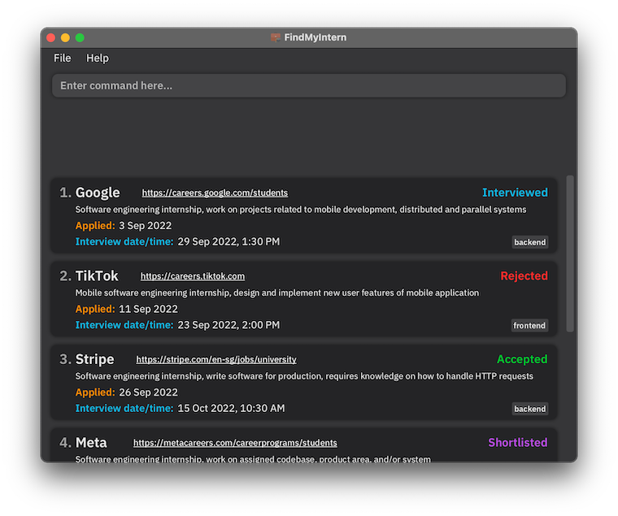

FindMyIntern helps students who are applying for internships keep track of their applications. It allows students to consolidate all these applications into a single place, manage these applications, and visualise their application statuses.
## Table of Contents
- [Quick Start](#quick-start)
- [Features](#features)
    - [Adding an internship application: `add`](#adding-an-internship-application-add)
    - [Marking an internship application status: `mark`](#marking-an-internship-application-status-mark)
    - [Listing all internship applications: `list`](#listing-all-internship-applications-list)
    - [Deleting an internship application: `delete`](#deleting-an-internship-application-delete)
    - [Filtering for internship applications of a specified status: `filter`](#filtering-for-internship-applications-of-a-specified-status-filter)
    - [Finding for an internship application: `find`](#finding-for-an-internship-application-find)
    - [Exiting the program: `exit`](#exiting-the-program-exit)
    - [Saving the data](#saving-the-data)

--------------------------------------------------------------------------------------------------------------------

## Quick start

1. Ensure you have Java `11` or above installed in your Computer.

1. Download the latest `findmyintern.jar` from [here](https://github.com/AY2223S1-CS2103T-T14-1/tp/releases).

1. Copy the file to the folder you want to use as the _home folder_ for your FindMyIntern.

1. Double-click the file to start the app. The GUI similar to the below should appear in a few seconds. Note how the app contains some sample data. 
   

1. Type the command in the command box and press Enter to execute it. e.g. typing **`list`** and pressing Enter will list all internship applications. 
   Some example commands you can try:

   * **`add software engineer internship at Apple`** : Adds an internship application titled “software engineer internship at Apple”.

   * **`mark 3 interviewed`** : Marks the 3rd application shown in the current list as interviewed.

   * **`list`** : Lists all internship applications.

   * **`delete 3`** : Deletes the 3rd application shown in the current list.

   * **`find shopee`** : Finds an internship application called Shopee in the tracker.
   
   * **`filter rejected`** : Filters the tracker for internship applications with rejected status.

   * **`exit`** : Exits the app.

1. Refer to the [Features](#features) below for details of each command.

--------------------------------------------------------------------------------------------------------------------

## Features

### Adding an internship application: `add`
###### (coming soon)

Adds an internship to the tracker.

Format: `add [TITLE]`

Examples:
* `add software engineer internship at Apple`

### Marking an internship application status: `mark` 
###### (coming soon)

Marks an internship application status as rejected, interviewing, accepted or applied.

Format: `mark [INDEX] [STATUS]`

* Updates the application at the specified INDEX. The index refers to the index number shown in the displayed 
application list. The index **must be a positive integer** 1, 2, 3 ...

* Updates the application to the specific STATUS. The status refers to the current status of the application. 
The status **must be “rejected”, “interviewed”, “accepted” or “applied”**.

Examples:
* `mark 3 interviewed` - Marks the 3rd application status to be `interviewed`
* `mark 2 accepted` - Marks the 2nd application status to be `accepted`

### Listing all internship applications: `list`
###### (coming soon)

Shows a list of all internship applications.

Format: `list`

### Deleting an internship application: `delete`
###### (coming soon)

Deletes an internship application.

Format: `delete [INDEX]`

* Deletes the application at the specified `INDEX`.
* The `INDEX` refers to the index number shown in the displayed application list.
* The index **must be a positive integer** 1, 2, 3, …​

Examples:
*  `delete 4` - Deletes the 4th application in the list.

### Filtering for internship applications of a specified status: `filter`

###### (coming soon)

Format: `filter [STATUS]`

* Filters for applications of the specified STATUS.

Examples:
* `filter accepted` - Shows a list of applications marked as `accepted`
* `filter rejected` - Shows a list of applications marked as `rejected`

### Finding for an internship application: `find`
###### (coming soon)

Finds internship applications which contain any of the given keywords.

Format: `find [KEYWORD]`

* The search is case-insensitive e.g `google` will match `Google`

* Partial words will be matched e.g. `goo` will match `Google`

Examples:
* `find google` returns the application containing `Google`
* `find apple` returns the application containing `Apple`

### Exiting the program: `exit`
###### (coming soon)

Exits the program.

Format: `exit`

### Saving the data
###### (coming soon)

FindMyIntern data is saved in the hard disk automatically after any command that changes the data. There is no need to save manually.

--------------------------------------------------------------------------------------------------------------------

## FAQ

**Q**: How do I transfer my data to another Computer? 
**A**: Install the app in the other computer and overwrite the empty data file it creates with the file that contains the data of your previous FindMyIntern home folder.

--------------------------------------------------------------------------------------------------------------------

## Command summary

Action | Format, Examples
--------|------------------
**Add** | `add [TITLE]`   e.g., `add software engineer internship at Apple`
**Mark** | `mark [INDEX] [STATUS]`   e.g., `mark 3 interviewed`
**List** | `list`
**Delete** | `delete [INDEX]`   e.g., `delete 4`
**Filter** | `filter [STATUS]`   e.g., `filter accepted`
**Find** | `find [KEYWORD]`  e.g., `find google`
**Exit** | `exit`
